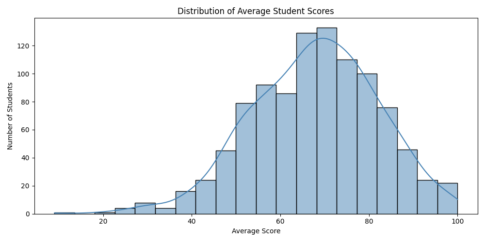
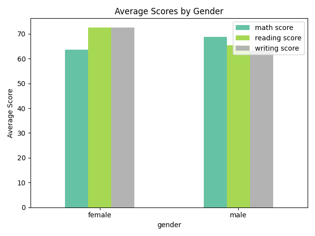
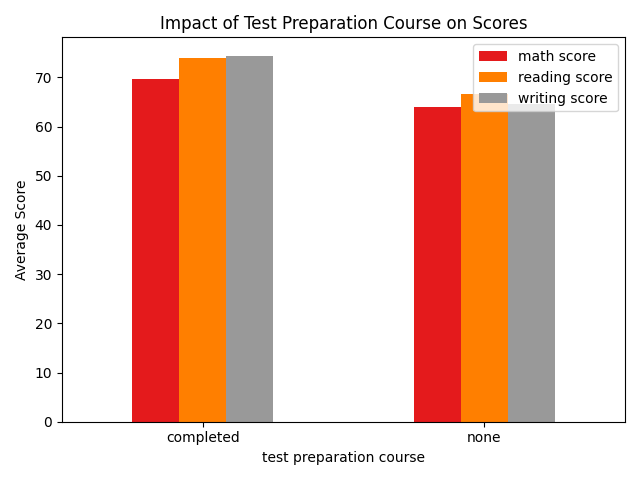
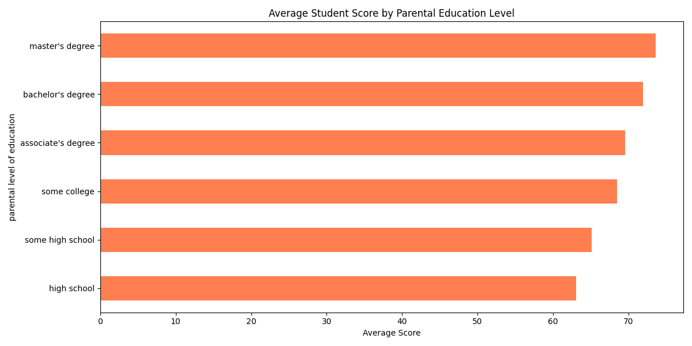
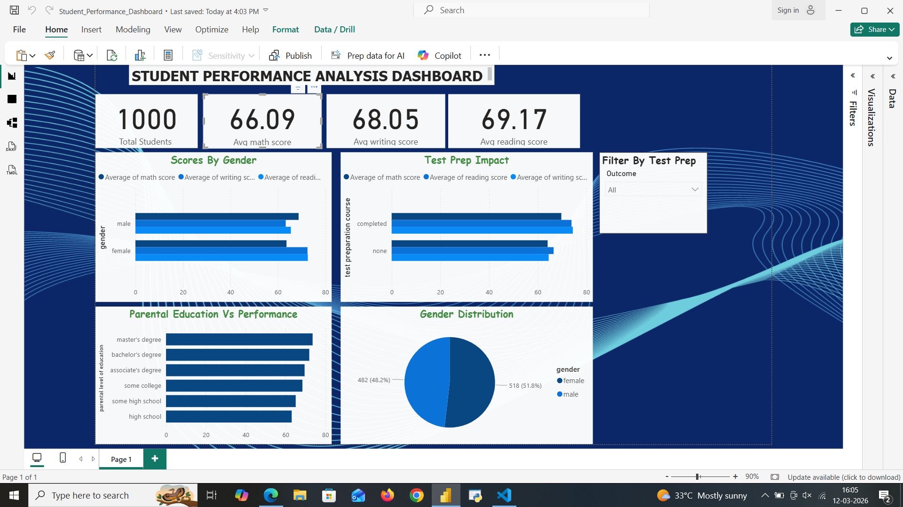

# 🎓 Student Performance Analysis

## 📌 Project Overview
This project analyzes factors affecting student academic performance 
using a dataset of 1,000 students. The goal is to uncover patterns 
and insights that can help educators make data-driven decisions.

## 🛠️ Tools & Technologies
- **Python** — Data analysis & visualization
- **Pandas** — Data manipulation
- **Matplotlib & Seaborn** — Data visualization
- **Excel** — Supporting analysis

## 📊 Dataset
- **Source:** Kaggle — Students Performance in Exams
- **Size:** 1,000 students
- **Features:** Gender, Parental Education, Lunch Type, 
  Test Preparation, Math Score, Reading Score, Writing Score

## 🔍 Key Findings
1. **Test Preparation works** — Students who completed the prep 
   course scored 5–10 points higher across all subjects
2. **Parental Education matters** — Students with parents holding 
   a master's degree averaged 73+ points vs 63 for high school only
3. **Gender differences exist** — Females outperform males in 
   reading and writing; males score slightly higher in math
4. **Score distribution** — Majority of students score between 
   60–80, showing a near-normal distribution

## 📁 Project Structure
```
Student-Performance-Analysis/
│
├── data/                  # Raw dataset
├── notebooks/             # Python analysis script
├── visuals/               # Generated charts
└── README.md              # Project documentation
```

## 📈 Visualizations
### Score Distribution


### Scores by Gender


### Test Prep Impact


### Parental Education Impact


## 💡 Recommendations
- Schools should actively promote test preparation courses
- Additional support should be provided to students from 
  lower parental education backgrounds
- Gender-specific learning strategies may improve overall outcomes


## 📊 Power BI Dashboard

An interactive dashboard was built using Power BI Desktop to present 
the findings visually in a business-ready format.

### 🔧 Dashboard Features
- **KPI Cards** — Total Students (1000), Average Math Score (66.09), 
  Average Writing Score (68.05), Average Reading Score (69.17)
- **Scores by Gender** — Clustered bar chart comparing math, writing 
  and reading scores across male and female students
- **Test Prep Impact** — Bar chart showing score differences between 
  students who completed vs did not complete test preparation
- **Parental Education vs Performance** — Horizontal bar chart showing 
  how parental education level correlates with average student scores
- **Gender Distribution** — Pie chart showing 51.8% male and 48.2% 
  female student split
- **Interactive Slicer** — Filter entire dashboard by test preparation 
  course outcome in real time

### 📸 Dashboard Preview


### 💡 Key Business Insights from Dashboard
1. Students who completed test preparation scored 5–10 points higher 
   across all subjects
2. Parental education level has a direct positive correlation with 
   student performance
3. Female students outperform males in writing and reading while males 
   score slightly higher in math
4. Overall average scores range between 66–69 suggesting room for 
   institutional improvement

## 👩‍💻 Author
**Rahmath B.** | Aspiring Data Analyst  
[LinkedIn Profile](https://linkedin.com/in/rahmath-b-562a68221)